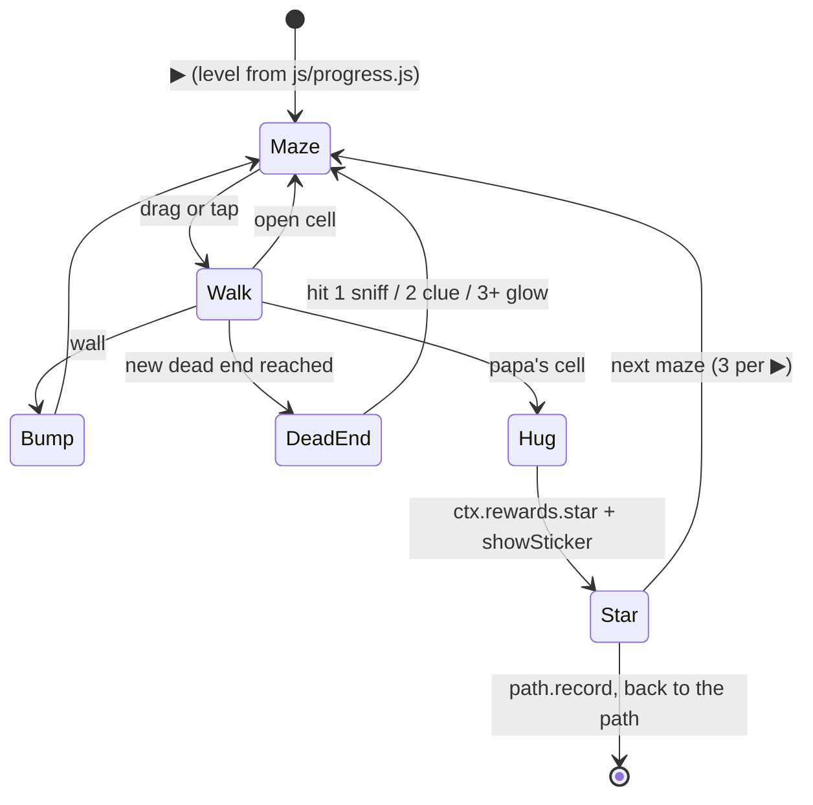

# Game 10 "Le Petit Jaguar" — design proposal (step M0)

Status: proposal only. No code. The owner decisions are fixed and not repeated here.

Read list: GAMES.md (table), CLAUDE.md (Level data, report style), docs/mailbox/game-09-proposal.md
(a, c), games/train/solver.mjs, js/path.js 1–20, tools/check-kit.mjs 29–45, js/progress.js
(grep: outcome names).

Game id: `jaguar`. Folder: `games/jaguar/`. Replaces "Le Jardin" as game 10.

## a. The 8 path steps

A maze is stored as **short side × long side** (portrait: cols × rows). In landscape the
game turns the maze 90° (see b). The same maze plays on every device.

| step | grid | cells | dead ends | loops | papa | shortest path (cells) | cell px at 360×640 / 640×360 |
|---|---|---|---|---|---|---|---|
| 1 | 3×4 | 12 | 1–2 | 0 | far | 6–9 | 96 / 90 |
| 2 | 4×5 | 20 | 2–3 | 0 | far | 8–13 | 86 / 68 |
| 3 | 4×6 | 24 | 3–5 | 0 | far | 10–16 | 86 / 68 |
| 4 | 5×7 | 35 | 5–8 | 0 | far | 14–22 | 68 / 54 |
| 5 | 5×8 | 40 | 6–9 | 1 | far | 14–24 | 68 / 54 |
| 6 | 5×9 | 45 | 7–11 | 2 | middle | 8–16 | 61 / 54 |
| 7 | 6×10 | 60 | 10–14 | 2 | middle | 10–20 | 55 / 45 |
| 8 | 6×12 | 72 | 12–18 | 3 | middle | 12–26 | 46 / 45 |

- Rounds per ▶: **3** (`roundsPerPlay = 3`, the progress.js default). A step-1 maze takes
  about 15 s; a step-8 maze about 1–2 min. 3 mazes give the skill a better signal than 2.
- The dead-end and path ranges are estimates. J1 measures them over 200 seeds and sets
  each range to the 10th–90th percentile of the samples.
- far = papa near the far side from the jaguar. middle = papa in the centre of the maze,
  the jaguar on the outer ring. A centre goal is harder: its entry corridor is hidden.
- 1 star per maze.

## b. The touch problem

Layout assumptions (as game 9; J2 measures them with the gate): top bar 72 px, margin
8 px. Usable board = (W − 16) × (H − 88).

Option 2 — cells always ≥ 64 px. Cells that fit at each size (short × long, maze turned
to the screen):

| size | usable px | cells at 64 px |
|---|---|---|
| 360×640 | 344 × 552 | 5 × 8 |
| 640×360 | 624 × 272 | **4** × 9 |
| 412×915 | 396 × 827 | 6 × 12 |
| 915×412 | 899 × 324 | 5 × 14 |
| 800×1280 | 784 × 1192 | 12 × 18 |
| 1280×800 | 1264 × 712 | 11 × 19 |
| 1366×657 | 1350 × 569 | 8 × 21 |

The same maze on all devices must fit 640×360: **max 4 × 8 = 32 cells**. That is step 3
at most. It is too small for 8 steps, and the kids are quick. Without the 90° turn, the
max is 4 × 4.

Option 1 — cells smaller than 64 px, floor **44 px**. Cell size per step is in table a.
At the 7 sizes, the largest maze (6×12) gets: 46, 45, 66, 54, 96 (cap), 96 (cap), 94 px.
The smallest cell is 45 px (640×360). Rules that keep the touch rule:
- A maze cell is **not a touch target**. The touch targets are the jaguar and the board.
- The jaguar's hit box is ≥ 64 px and centred on its cell. Its art may be smaller than
  the hit box. The gate checks the hit box as a touch target.
- A tap anywhere on the board moves the jaguar one step in the tap's main direction
  (see d). So a tap needs no precise cell.
- Gate change, this game only: `minCell: 44` in `games/jaguar/checks.js` (the grid-cell
  check). The cells are marked as cells, not as touch targets. Shared gate code does not
  change, if the gate reads `minCell` per game (J2 confirms).

**Recommendation: Option 1, with the same mazes on all devices.** Same mazes = same
difficulty on phone and tablet, and the solver does not depend on the screen. Phones get
small cells only at steps 4–8; tablets and the laptop stay ≥ 54 px. If the playtest shows
that 45 px is too small, step 8 becomes 6×10 (no other change).

## c. Maze generator

Pure module `games/jaguar/maze.js` (as `board.js` in game 9). `makeMaze(level, rng, lastKey)`
→ `{ cols, rows, walls, start, papa, path, deadEnds, key }`. The game passes `Math.random`;
the gate passes a seeded rng.

Algorithm:
1. **Growing tree** on the grid, parameter `bias` (0–1). Each step takes the newest cell
   (prob 1 − bias) or a random cell of the list (prob bias). bias 0 = recursive
   backtracker: long winding corridors, few dead ends. bias 1 = Prim: many short dead ends.
   The result is a perfect maze (one path between 2 cells).
2. **Loops**: open `loops` more walls, picked at random among inner walls whose 2 cells
   are ≥ 4 steps apart in the tree. So each loop is a real second route, not a 2×2 square.
3. **Start and papa**: far → jaguar in a random corner, papa in a random cell with BFS
   distance ≥ 90 % of the max distance. middle → papa in a random cell of the centre box
   (middle third of cols and rows, at least 1 cell), jaguar on a random outer-ring cell.
4. **Counts** (after the loops): dead end = a cell with 1 opening, not the start and not
   papa. Shortest path = BFS start → papa.
5. **Rejection**: if the dead ends or the path length are out of range, or `key` =
   `lastKey`, try again with the same rng. Max 500 tries, then it throws.

`key` = the walls as a bit string + start + papa. "Never the same maze twice in a row" =
the game passes the last key.

levels.json:

```json
{ "schemaVersion": 1, "game": "jaguar", "levels": [
  { "id": 1, "difficulty": 1, "cols": 3, "rows": 4, "bias": 0, "loops": 0, "papa": "far",
    "deadEnds": [1, 2], "path": [6, 9] },
  { "id": 8, "difficulty": 8, "cols": 6, "rows": 12, "bias": 0.7, "loops": 3, "papa": "middle",
    "deadEnds": [12, 18], "path": [12, 26] }
] }
```

| field | type | meaning |
|---|---|---|
| `id`, `difficulty` | integer | as every new-engine game (never renumber `id`) |
| `cols`, `rows` | integer 3–6 / 4–12 | short side × long side; cap 6×12 (layout) |
| `bias` | number 0–1 | growing-tree pick: 0 = long corridors, 1 = many short dead ends |
| `loops` | integer 0–4 | extra walls opened after the tree |
| `papa` | `"far"` \| `"middle"` | papa position rule |
| `deadEnds` | [min, max] | dead-end count range |
| `path` | [min, max] | shortest path length range (cells, start and papa included) |

`solver.mjs`:
- `solve(level)` → throws when `cols × rows` > 6×12, `min > max` in a range, or
  `makeMaze` fails 500 tries. Returns `{ solvable: true, minMoves }`, minMoves = the
  median shortest path of 50 seeded mazes (difficulty table only).
- `sampleRound(level, rng)` = one maze exactly as the game makes it (last key kept per
  level id between seeds). It throws (the gate names level and seed) when:
  - a cell is not reachable from the start (not connected);
  - papa is not reachable from the start, or start = papa;
  - the shortest path is out of `path`;
  - the dead-end count is out of `deadEnds`;
  - openings − (cells − 1) ≠ `loops` (the loop count is exact);
  - papa breaks its rule (far: < 90 % of max distance; middle: out of the centre box);
  - `key` = the previous key.
  - Else it returns `{ answers: 1 }`. The gate's loop (seeds 1…200, `answers === 1`) runs
    unchanged.

## d. The drag mechanic

Pointer events on the board (`touch-action: none`, pointer capture). No
`requestAnimationFrame`: a `setTimeout` queue moves the jaguar, max 1 cell per 70 ms, with
a CSS transition. Game-local code (`games/jaguar/drag.js`): the shared `dragdrop.js`
makes a ghost copy, and the jaguar must not leave the maze.

- **Start a drag**: pointerdown in the jaguar's hit box (≥ 64 px).
- **Follow**: the game keeps the finger's trail as a list of cells. Between 2 pointer
  samples, it fills the skipped cells (grid line walk), so a fast finger leaves no hole.
  The jaguar walks the trail cell by cell. It takes the next trail cell only if that cell
  is a neighbour with no wall between.
- **Wall**: the jaguar stops on its side of the wall. It bumps (small squash, soft
  "pof"). It never jumps and never passes a wall. The trail cells behind the wall are
  dropped. When the finger comes back to a neighbour open cell, the jaguar follows again.
  A bump is never counted.
- **Fast drag**: the queue walks the trail at 70 ms per cell. The jaguar may lag behind
  the finger for a short time, then catches up. On pointerup, the cells already in the
  queue are walked (max 3), then it stops.
- **Tap** (pointerdown + pointerup, move < 10 px, not on the jaguar): one step in the
  tap's main direction (the larger of |dx|, |dy| from the jaguar's centre). If a wall is
  in that direction and the other direction is ≥ ⅓ of the main one and open, it steps
  there. Else it bumps. One tap = one step (owner decision).
- **Papa**: the jaguar enters papa's cell → the drag ends, hug animation, star.
- pointercancel = pointerup. Device turned mid-maze → the maze turns, the jaguar keeps
  its cell.

## e. Hints and path outcome

A **dead-end hit** = the jaguar reaches a dead-end cell (1 opening) for the first time in
this round. The same dead end counts once.

| dead-end hits | reaction | hint shown | outcome (js/progress.js) |
|---|---|---|---|
| 0 | — | none | `none` |
| 1 | the jaguar sniffs, papa calls (sound) | none | `none` |
| 2 | paw prints on the **next 2 cells** of the shortest path from the jaguar | clue | `clue` |
| 3+ | paw prints on the **whole** shortest path; they follow each step to papa | glow | `glow` |

- The shortest path is computed from the jaguar's cell at each hint (BFS; with loops, the
  shortest route).
- Clue paw prints stay until the jaguar walks over them; the next hit shows them again.
- Round outcome = the strongest hint shown in the round → `ctx.path.record(level, outcome)`.
  `dance` and `again` are not used. Never a failure screen; the maze always ends with the hug.

Stored data:

| field | written by (app version) | read by | migration |
|---|---|---|---|
| `profiles[p].skills.jaguar` | path, from the jaguar release | js/progress.js | none (new key; `getSkill` default) |
| `profiles[p].rewards / collection / worlds` | `addStar`, as every game | rewards, worlds screens | none |

Round flow:



## f. Risks and session split

Risks:
1. 45 px cells (640×360, steps 7–8): a 6-year-old finger covers 2 cells. The trail walk
   and the tap direction rule reduce the need for precision. The playtest decides; the
   fallback is step 8 = 6×10.
2. The 64 px rule: kid-ux-reviewer can flag the small cells. J2 writes the exception
   (cells are not touch targets; jaguar hit box ≥ 64 px) in `games/jaguar/CLAUDE.md`.
3. Loops (steps 5–8): a child can walk round a loop and never reach a dead end. Then no
   hint comes. Accepted for v1; J2 notes it for the playtest.
4. Rejection sampling: a range that is too tight makes `makeMaze` slow or throw. The gate
   (200 seeds) catches it; J1 sets the ranges from measured samples.
5. GAMES.md line 40 says "Games 8–10 keep `levels.js`". Game 10 now uses the new engine.
   The owner decides if that line changes (not changed in M0).
6. The world (`meta.scene`) is unset until J3 → stars go to the start world until then.

| session | model | files | gate | reviewers |
|---|---|---|---|---|
| J1 logic | Opus 5.5 | games/jaguar/{maze.js, levels.json, levels.schema.json, solver.mjs, CLAUDE.md}, tests/jaguar.test.mjs | `--only unit,levels,privacy` (no UI yet) | — |
| J2 UI + path | Opus 5.5 | games/jaguar/{meta.js, jaguar.js, drag.js, art.js, strings.js, jaguar.css, checks.js}, games/registry.js (1 line), sw.js PRECACHE via update-precache | each step: `--game jaguar --quick` + privacy; checkpoint: `--game jaguar` + privacy | kid-ux-reviewer at the checkpoint |
| J3 jungle world + preview | Sonnet 5.5 (pack by the scene-artist subagent) | scenes/jungle/pack.js, scenes/registry.js (1 line), games/jaguar/meta.js (`scene: 'jungle'`), preview version | full gate (registry = shared) | pwa-guardian |

## g. Open questions for the owner

1. **Small cells:** approve maze cells down to 44 px on phones (Option 1)? The jaguar
   hit box stays ≥ 64 px.
2. **Hint ladder:** first dead end = no hint (proposal), or paw prints from the first dead end?
3. **Far tap:** one tap = one step always (proposal), or a tap in a straight open corridor
   walks the jaguar to the tapped cell?
